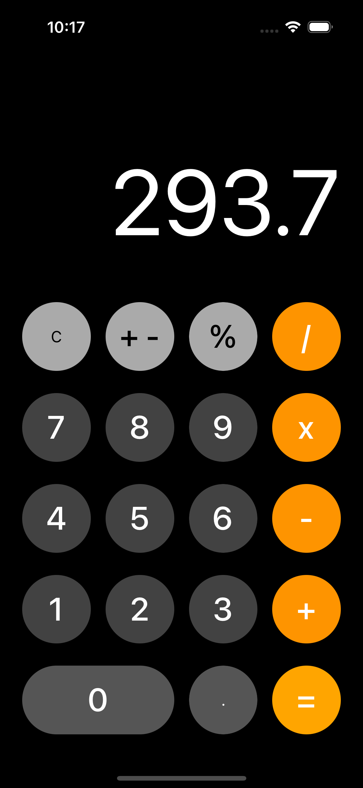

# iOS-Swift_Beginner-to-advanced
Repository dedicated to mastering Swift and iOS app development through practical exercises and projects

# Calculadora iOS

Esta es una aplicación simple de calculadora para iOS desarrollada en Swift. La aplicación permite realizar operaciones básicas de suma, resta, multiplicación y división, así como también calcular porcentajes.

## Capturas de pantalla

## Características

- Operaciones básicas: suma, resta, multiplicación y división.
- Cálculo de porcentaje.
- Interfaz de usuario intuitiva.

## Cómo utilizar

1. Clona el repositorio en tu máquina local.
2. Abre el proyecto en Xcode.
3. Compila y ejecuta la aplicación en un simulador o dispositivo iOS.

## Contribuciones

Las contribuciones son bienvenidas. Si encuentras algún problema o tienes una mejora, no dudes en abrir un problema o enviar una solicitud de extracción.

---

¡Espero que encuentres útil este README! Siéntete libre de personalizarlo según las necesidades específicas de tu proyecto.